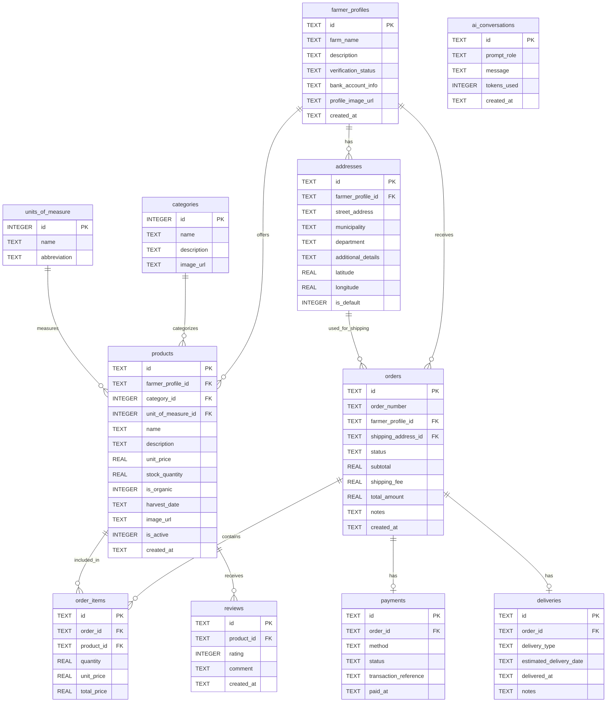

# Agromarket Local

**Autores:**
- **Jorge Bolivar (Backend)**
- **Bryan Pacheco (Backend IA)**
- **Lizeth Anay Bedoya Bolívar (QA)**


**AgroMarket Local** es una plataforma integral de comercio electrónico diseñada para conectar directamente a los agricultores con los consumidores urbanos, eliminando intermediarios y garantizando productos frescos con trazabilidad completa.

**Características:**
- **Catálogo de Productos:** Gestión completa de productos con categorías y unidades de medida.
- **Gestión de Pedidos:** Flujo completo de pedidos con estados y notificaciones.
- **Pagos y Logística:** Integración de pagos y gestión de entregas.
- **Reseñas:** Sistema de reseñas para productos.
- **IA:** Integración con GROQ API para análisis inteligente de datos.

## Esquema de Base de Datos

A continuación se muestra el diagrama de entidad-relación (ERD) de la base de datos generada a partir de `schema.sql`:



## Flujos del Sistema (Diagramas Mermaid)

En esta sección se presentan los flujos lógicos y básicos de interacción entre los diferentes componentes del sistema.

### 1. Registrar Productos (Agricultor)
Este flujo representa cómo un agricultor agrega un nuevo producto a su catálogo disponible en la plataforma.

```mermaid
sequenceDiagram
    autonumber
    actor Agricultor
    participant UI as Interfaz de Usuario
    participant API as Backend (API)
    database DB as Base de Datos

    Agricultor->>UI: Completa formulario de producto
    Note over UI: Valida campos básicos<br/>(precio >= 0, stock >= 0)
    UI->>API: POST /api/products (datos + Farmer Token)
    API->>DB: Validar existencia de Farmer, Category y Unit of Measure
    DB-->>API: OK (Referencias válidas)
    API->>DB: INSERT INTO products
    DB-->>API: OK (Producto Creado)
    API-->>UI: 201 Created (Detalles del producto)
    UI-->>Agricultor: Muestra confirmación de registro y actualiza catálogo
```

---

### 2. Registrar Órdenes de Compra (Consumidor)
Este flujo detalla cómo un consumidor genera un pedido a partir de su carrito de compras.

```mermaid
sequenceDiagram
    autonumber
    actor Consumidor
    participant UI as Interfaz de Usuario
    participant API as Backend (API)
    database DB as Base de Datos

    Consumidor->>UI: Confirma compra desde el carrito
    UI->>API: POST /api/orders (Address ID, Items y Cantidades)
    API->>DB: Consultar stock y dirección del consumidor
    DB-->>API: Retorna stock actual y datos de dirección
    Note over API: Valida stock suficiente y calcula:<br/>Subtotal, Costo de envío y Total
    API->>DB: INSERT INTO orders (Status: 'Pending')
    API->>DB: INSERT INTO order_items (por cada item)
    API->>DB: UPDATE products SET stock_quantity = stock_quantity - Qty
    DB-->>API: Transacción Exitosa
    API-->>UI: 201 Created (Detalles del Pedido e ID)
    UI-->>Consumidor: Muestra resumen del pedido y botón para proceder al pago
```

---

### 3. Registrar Pago (Consumidor)
Detalla la lógica para formalizar el pago de una orden y actualizar los estados correspondientes.

```mermaid
sequenceDiagram
    autonumber
    actor Consumidor
    participant UI as Interfaz de Usuario
    participant API as Backend (API)
    database DB as Base de Datos

    Consumidor->>UI: Selecciona método de pago e ingresa datos
    UI->>API: POST /api/payments (Order ID, Método, Referencia)
    API->>DB: Validar estado de la orden (Status == 'Pending')
    DB-->>API: Orden válida
    alt Pago en Efectivo (Contra Entrega)
        API->>DB: INSERT INTO payments (Status: 'Pending')
        Note over API, DB: La orden continúa en proceso de entrega
    else Pago Digital (Transferencia Bancaria / Billetera Digital)
        Note over API: Valida referencia de transacción
        API->>DB: INSERT INTO payments (Status: 'Approved')
        API->>DB: UPDATE orders SET status = 'Confirmed'
        API->>DB: INSERT INTO deliveries (Crear programación de entrega)
    end
    DB-->>API: OK (Guardado)
    API-->>UI: 200 OK (Detalles del pago y estado actualizado)
    UI-->>Consumidor: Muestra confirmación del pago y estado de su entrega
```

---

### 4. Registro de Reseña (Consumidor)
Lógica para que un consumidor califique un producto adquirido.

```mermaid
sequenceDiagram
    autonumber
    actor Consumidor
    participant UI as Interfaz de Usuario
    participant API as Backend (API)
    database DB as Base de Datos

    Consumidor->>UI: Escribe calificación (1-5 estrellas) y comentario
    UI->>API: POST /api/reviews (Product ID, Rating, Comment)
    Note over API: Valida rango de Rating (1 a 5)
    API->>DB: INSERT INTO reviews
    DB-->>API: OK (Guardado)
    API-->>UI: 201 Created (Reseña Registrada)
    UI-->>Consumidor: Muestra mensaje de agradecimiento y publica la reseña
```

---

### 5. Recomendaciones con IA (Consumidor & Backend IA)
Interacción con la API de Groq para sugerir productos o analizar datos usando modelos de lenguaje.

```mermaid
sequenceDiagram
    autonumber
    actor Consumidor
    participant UI as Interfaz de Usuario
    participant API as Backend (API)
    database DB as Base de Datos
    participant Groq as Groq API (LLM)

    Consumidor->>UI: Solicita recomendación o análisis (Chat / Recomendaciones)
    UI->>API: POST /api/ai/recommendations (User Prompt)
    API->>DB: Consultar catálogo de productos, compras del usuario y reviews
    DB-->>API: Retorna datos agregados de contexto
    Note over API: Prepara System Prompt con el contexto del<br/>negocio y datos del catálogo
    API->>Groq: Enviar Prompt de Sistema + Prompt de Usuario + Contexto de Productos
    Groq-->>API: Retorna respuesta inteligente (Recomendación)
    API->>DB: INSERT INTO ai_conversations (Guardar log de tokens e interacción)
    DB-->>API: OK (Guardado)
    API-->>UI: 200 OK (Respuesta generada por la IA)
    UI-->>Consumidor: Muestra la recomendación de manera amigable y visual
```

## Endpoints de la API

La siguiente tabla detalla los posibles endpoints que componen la API del sistema:

| Módulo | Método | Endpoint | Descripción | Acceso / Rol |
| :--- | :---: | :--- | :--- | :--- |
| **Identidad / Perfiles** | `POST` | `/api/farmer-profiles` | Registrar un nuevo perfil de agricultor | Público / Agricultor |
| | `GET` | `/api/farmer-profiles/{id}` | Obtener información detallada de un agricultor | Público |
| | `PUT` | `/api/farmer-profiles/{id}` | Actualizar datos del perfil de un agricultor | Agricultor Propietario |
| | `POST` | `/api/addresses` | Registrar una dirección física (despacho/entrega) | Autenticado |
| | `GET` | `/api/addresses` | Listar direcciones registradas por el usuario | Autenticado |
| | `DELETE` | `/api/addresses/{id}` | Eliminar una dirección | Autenticado |
| **Catálogo** | `GET` | `/api/categories` | Listar todas las categorías de productos | Público |
| | `POST` | `/api/categories` | Crear una nueva categoría | Administrador |
| | `GET` | `/api/units-of-measure` | Listar todas las unidades de medida | Público |
| | `GET` | `/api/products` | Buscar y listar productos (filtros por categoría, precio, orgánico, agricultor) | Público |
| | `GET` | `/api/products/{id}` | Obtener el detalle de un producto específico | Público |
| | `POST` | `/api/products` | Publicar un nuevo producto en el catálogo | Agricultor |
| | `PUT` | `/api/products/{id}` | Actualizar información o stock de un producto | Agricultor Propietario |
| | `DELETE` | `/api/products/{id}` | Desactivar/Eliminar un producto del catálogo | Agricultor Propietario |
| **Pedidos** | `POST` | `/api/orders` | Crear una nueva orden de compra (carrito de compras) | Consumidor |
| | `GET` | `/api/orders` | Listar órdenes asociadas (compras del consumidor o ventas del agricultor) | Autenticado |
| | `GET` | `/api/orders/{id}` | Obtener detalles y artículos (`order_items`) de un pedido | Autenticado / Involucrado |
| | `PATCH` | `/api/orders/{id}/status` | Cambiar el estado del pedido (`Pending`, `Confirmed`, `Preparing`, `InTransit`, `Delivered`, `Cancelled`) | Agricultor / Repartidor |
| **Pagos y Logística** | `POST` | `/api/payments` | Registrar o procesar el pago de una orden de compra | Consumidor |
| | `GET` | `/api/orders/{id}/payment` | Consultar la información del pago de un pedido | Autenticado / Involucrado |
| | `GET` | `/api/orders/{id}/delivery` | Consultar información logística y fecha estimada de entrega | Autenticado / Involucrado |
| | `PATCH` | `/api/deliveries/{id}` | Actualizar datos de despacho/entrega (fecha real, notas logísticas) | Agricultor / Repartidor |
| **Reseñas** | `POST` | `/api/reviews` | Registrar calificación y comentario para un producto | Consumidor (Comprador) |
| | `GET` | `/api/products/{id}/reviews` | Obtener todas las reseñas y valoración promedio de un producto | Público |
| **IA (Groq)** | `POST` | `/api/ai/recommendations` | Obtener sugerencias de productos personalizadas o análisis de precios | Autenticado |
