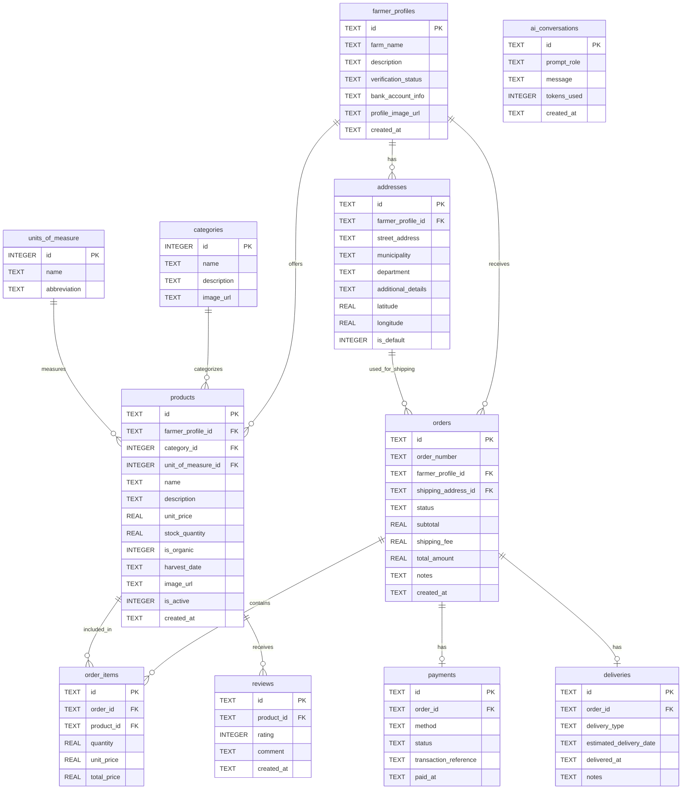

# Agromarket Local

**Autores:**
- **Jorge Bolivar**
- **Bryan Pacheco**
- **Lizeth Anay Bedoya Bolívar**

**AgroMarket Local** es una plataforma integral de comercio electrónico diseñada para conectar directamente a los agricultores con los consumidores urbanos, eliminando intermediarios y garantizando productos frescos con trazabilidad completa.

**Características:**
- **Catálogo de Productos:** Gestión completa de productos con categorías y unidades de medida.
- **Gestión de Pedidos:** Flujo completo de pedidos con estados y notificaciones.
- **Pagos y Logística:** Integración de pagos y gestión de entregas.
- **Reseñas:** Sistema de reseñas para productos.
- **IA:** Integración con GROQ API para análisis inteligente de datos.

## Esquema de Base de Datos

A continuación se muestra el diagrama de entidad-relación (ERD) de la base de datos generada a partir de `schema.sql`:

