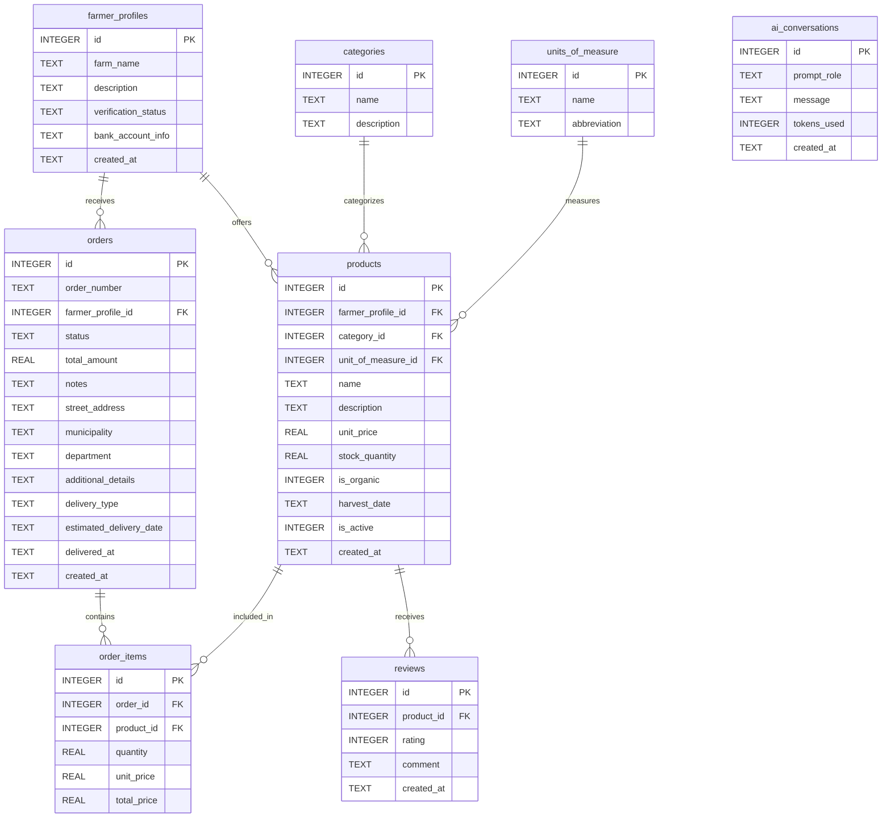
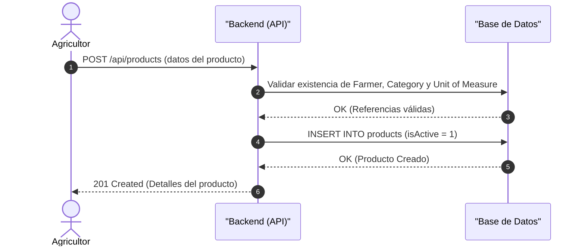
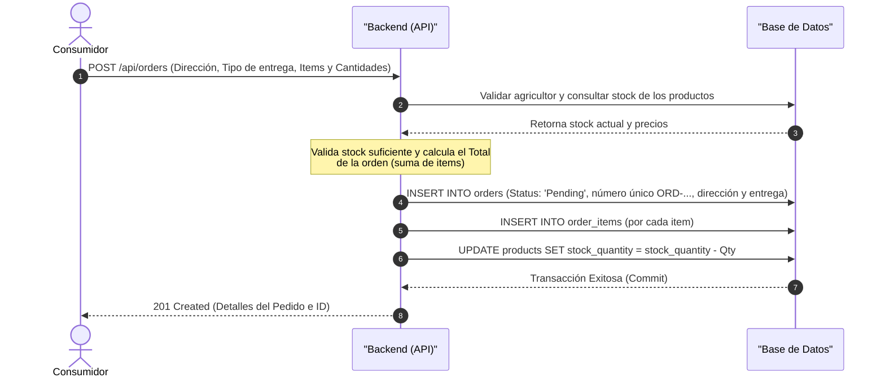
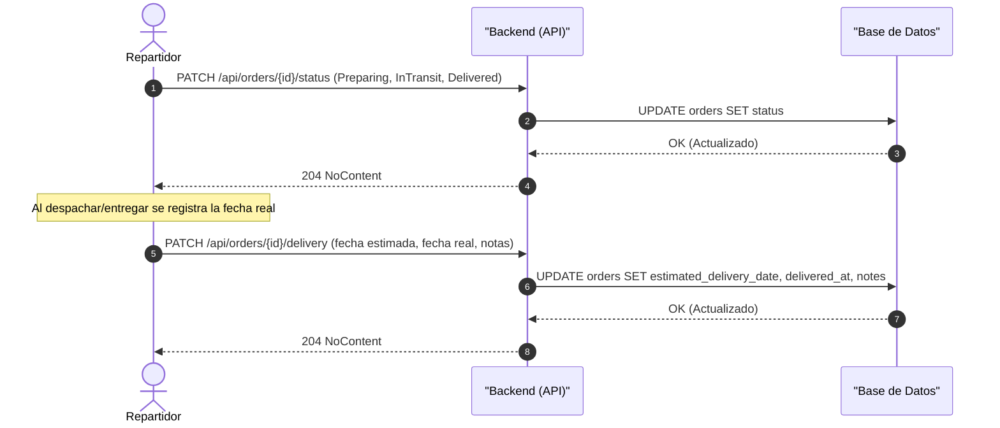
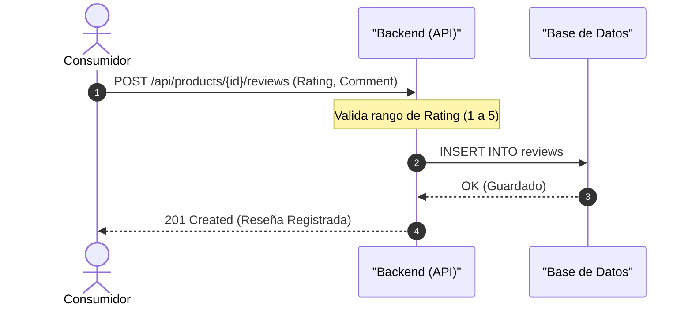
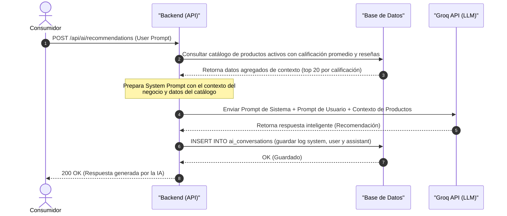

# AgroMarket Local

**Autores:**
- **Jorge Bolivar (Backend)**
- **Bryan Pacheco (Backend IA)**
- **Lizeth Anay Bedoya Bolívar (QA)**

**AgroMarket Local** es una plataforma integral de comercio electrónico diseñada para conectar directamente a los agricultores con los consumidores urbanos, eliminando intermediarios y garantizando productos frescos con trazabilidad completa.

**Características:**
- **Catálogo de Productos:** Gestión completa de productos con categorías y unidades de medida.
- **Gestión de Pedidos:** Flujo completo de pedidos con estados, dirección de envío y descuento automático de stock.
- **Logística:** Gestión de entregas y despachos (recogida en finca, entrega a domicilio o punto de mercado local).
- **Reseñas:** Sistema de reseñas con calificación de 1 a 5 y valoración promedio por producto.
- **IA:** Recomendaciones inteligentes integradas con la API de Groq (modelo `llama-3.3-70b-versatile`), que analiza el catálogo y sugiere productos con el historial de conversaciones guardado en la base de datos.

## Tecnologías

| Tecnología | Uso en el proyecto |
| :--- | :--- |
| **.NET 8 / ASP.NET Core** | Framework base del backend (Web API, `net8.0`) |
| **Entity Framework Core** | ORM para el acceso a datos (`Data/AppDbContext.cs`) |
| **SQLite** | Base de datos embebida, creada automáticamente desde `schema.sql` |
| **Swagger / OpenAPI** | Documentación interactiva de la API en `/swagger` |
| **Groq API (LLM)** | Generación de recomendaciones con IA (`GroqService`) |
| **JSON (string enums)** | Serialización de enums como texto (`JsonStringEnumConverter`) |
| **REST Client (`.http`)** | Archivo `MarketPlace.http` con ejemplos de peticiones |

**Paquetes NuGet:** `Microsoft.EntityFrameworkCore.Sqlite` (8.0.11), `Microsoft.AspNetCore.OpenApi` (8.0.29), `Swashbuckle.AspNetCore` (6.6.2).

## Esquema de Base de Datos

A continuación se muestra el diagrama de entidad-relación (ERD) de la base de datos generada a partir de `schema.sql`:



La base de datos incluye datos semilla (seed) para 4 categorías (Frutas, Hortalizas y Verduras, Tubérculos y Raíces, Lácteos y Derivados) y 5 unidades de medida (kg, lb, atado, unidad, caja), definidas en `schema.sql`.

## Estado Actual del Proyecto

El backend está construido con **ASP.NET Core 8 (.NET 8)** con la estructura base creada en `MarketPlace/`.

**Implementado:**
- **Capa de modelos** (`Models/`) con clases para las 8 tablas del esquema: `FarmerProfile`, `Categorie`, `UnitOfMeasure`, `Product`, `Order`, `OrderItem`, `Review` y `AiConversation`, además de los DTOs de solicitud (`AiRequest`, `OrderRequest`, `StatusUpdateRequest`, `DeliveryUpdateRequest`) y respuesta (`ProductReviewsResponse`).
- **Enums** para las columnas con restricciones `CHECK`: `VerificationStatus` (Pending, Approved, Rejected), `StatusOrder` (Pending, Confirmed, Preparing, InTransit, Delivered, Cancelled), `DeliveryType` (FarmPickup, DirectHomeDelivery, LocalMarketPoint) y `PromptRole` (system, user, assistant).
- **Controladores** (`Controllers/`) agrupados por dominio: perfiles de agricultores, catálogo (categorías, unidades, productos y reseñas), pedidos (incluye dirección de envío, control de stock y entrega) e IA.
- **Capa de datos**: EF Core + SQLite (`Data/AppDbContext.cs`); la base de datos se crea automáticamente desde `schema.sql` al iniciar la aplicación por primera vez, con índices de rendimiento en las llaves foráneas.
- **IA integrada con Groq**: el endpoint `POST /api/ai/recommendations` consulta el catálogo de productos activos con su calificación promedio, construye un contexto con los 20 productos mejor valorados, envía el prompt a la API de Groq y guarda la conversación (system, user y assistant) en la tabla `ai_conversations`.
- **Swagger / OpenAPI** con documentación XML de todos los endpoints.
- **Enums serializados como texto** (`JsonStringEnumConverter`), de modo que los valores viajan como cadenas (`"Pending"`, `"DirectHomeDelivery"`, etc.).

**Pendiente:**
- Autenticación y autorización por rol (Agricultor / Consumidor / Administrador).
- Módulo de pagos (fuera de alcance; la entrega se programa al crear la orden).

## Flujos del Sistema (Diagramas Mermaid)

En esta sección se presentan los flujos de interacción entre los clientes HTTP (Swagger, Postman o `MarketPlace.http`) y la API.

### 1. Registrar Productos (Agricultor)
Este flujo representa cómo un agricultor agrega un nuevo producto a su catálogo disponible en la plataforma.



---

### 2. Registrar Órdenes de Compra (Consumidor)
Este flujo detalla cómo un consumidor genera un pedido de compra mediante una solicitud HTTP.



---

### 3. Entrega de la Orden (Agricultor / Repartidor)
Lógica para actualizar el estado de la orden y registrar los datos de entrega.



---

### 4. Registro de Reseña (Consumidor)
Lógica para que un consumidor califique un producto adquirido.



---

### 5. Recomendaciones con IA (Consumidor & Backend IA)
Interacción real con la API de Groq: el backend construye un contexto con los productos activos mejor calificados y genera la recomendación con el modelo `llama-3.3-70b-versatile`.



## Endpoints de la API

La siguiente tabla detalla los endpoints que componen la API del sistema:

| Módulo | Método | Endpoint | Descripción | Acceso / Rol |
| :--- | :---: | :--- | :--- | :--- |
| **Identidad / Perfiles** | `GET` | `/api/farmer-profiles` | Listar todos los perfiles de agricultores registrados | Público |
| | `GET` | `/api/farmer-profiles/{id}` | Obtener información detallada de un agricultor | Público |
| | `POST` | `/api/farmer-profiles` | Registrar un nuevo perfil de agricultor | Público |
| **Catálogo** | `GET` | `/api/categories` | Listar todas las categorías de productos | Público |
| | `GET` | `/api/units-of-measure` | Listar todas las unidades de medida | Público |
| | `GET` | `/api/products` | Buscar y listar productos activos (filtros por categoría, orgánico y agricultor) | Público |
| | `GET` | `/api/products/{id}` | Obtener el detalle de un producto específico | Público |
| | `POST` | `/api/products` | Publicar un nuevo producto en el catálogo | Agricultor |
| | `GET` | `/api/products/{id}/reviews` | Obtener las reseñas y valoración promedio de un producto | Público |
| | `POST` | `/api/products/{id}/reviews` | Registrar calificación (1-5) y comentario para un producto | Público |
| **Pedidos** | `POST` | `/api/orders` | Crear una orden de compra con dirección de envío, tipo de entrega y artículos (valida stock y descuenta inventario) | Público |
| | `GET` | `/api/orders` | Listar todas las órdenes | Público |
| | `GET` | `/api/orders/{id}` | Obtener detalles y artículos (`order_items`) de un pedido | Público |
| | `PATCH` | `/api/orders/{id}/status` | Cambiar el estado del pedido (`Pending`, `Confirmed`, `Preparing`, `InTransit`, `Delivered`, `Cancelled`) | Público |
| | `PATCH` | `/api/orders/{id}/delivery` | Actualizar datos de entrega (fecha estimada, fecha real, notas) | Público |
| **IA (Groq)** | `POST` | `/api/ai/recommendations` | Obtener sugerencias de productos personalizadas o análisis de precios (integración real con Groq, guarda el log en `ai_conversations`) | Público |

## Cómo Probar el Proyecto

### Requisitos previos

- **.NET SDK 8** instalado (verificar con `dotnet --version`).
- Conexión a internet solo si se desea probar el endpoint de IA (consume la API de Groq).

### Configuración de la clave de Groq (IA)

La clave de la API de Groq se encuentra en `appsettings.json`, en la sección `Groq`:

```json
"Groq": {
  "ApiKey": "gsk_...",
  "Model": "llama-3.3-70b-versatile",
  "BaseUrl": "https://api.groq.com/openai/v1/"
}
```

Si no se desea exponer la clave en el repositorio, se puede sobrescribir con la variable de entorno `Groq__ApiKey`. Sin clave válida, el endpoint `POST /api/ai/recommendations` responderá con un error de autorización de Groq (el resto de la API funciona sin ella).

### Pasos para ejecutar

1. Abrir una terminal en la carpeta del proyecto backend:

   ```bash
   cd retos/proyecto-final/MarketPlace
   ```

2. Restaurar los paquetes NuGet:

   ```bash
   dotnet restore
   ```

3. Ejecutar la aplicación:

   ```bash
   dotnet run
   ```

   Al iniciar por primera vez, la base de datos SQLite (`marketplace.db`) se crea automáticamente a partir de `schema.sql` con sus datos semilla (categorías y unidades de medida).

4. Abrir Swagger en el navegador:

   ```
   http://localhost:5008/swagger
   ```

### Formas de probar la API

1. **Swagger UI** (`http://localhost:5008/swagger`): documentación interactiva con todos los endpoints y ejemplos de esquemas de solicitud.

2. **`MarketPlace.http`** (archivo del proyecto): requiere la extensión **REST Client** de VS Code. Contiene peticiones de ejemplo para cada flujo; los IDs marcados como `REEMPLAZAR_CON_ID_...` deben sustituirse con los valores reales obtenidos en las respuestas.

3. **Postman / Insomnia**: importar la especificación OpenAPI desde `http://localhost:5008/swagger/v1/swagger.json` o crear las peticiones manualmente según la tabla de endpoints.

### Flujo de prueba recomendado (punto a punto)

1. **Registrar un agricultor**: `POST /api/farmer-profiles` (guardar el `id` de la respuesta).
2. **Publicar un producto**: `POST /api/products` usando el `id` del agricultor, `categoryId: 1` y `unitOfMeasureId: 1` (guardar el `id` del producto).
3. **Consultar el catálogo**: `GET /api/products` y probar filtros como `?categoryId=1` o `?isOrganic=true`.
4. **Crear una orden**: `POST /api/orders` con dirección de envío, `deliveryType` y los artículos (verificar que el stock del producto se descuenta).
5. **Consultar el detalle de la orden**: `GET /api/orders/{id}` (incluye `order_items` y datos de entrega).
6. **Cambiar estados**: `PATCH /api/orders/{id}/status` (`Confirmed`, `Preparing`, `InTransit`, `Delivered`).
7. **Actualizar la entrega**: `PATCH /api/orders/{id}/delivery` con fecha real y notas.
8. **Registrar una reseña**: `POST /api/products/{id}/reviews` con un `rating` entre 1 y 5.
9. **Consultar reseñas**: `GET /api/products/{id}/reviews` (incluye el promedio).
10. **Recomendaciones con IA**: `POST /api/ai/recommendations` con un prompt como "Recomiéndame frutas frescas para esta semana".

## Pruebas y Documentación (QA)

La validación QA fue realizada por **QA - Lizeth Bedoya** sobre los servicios públicos de la API. Se probaron los flujos principales del marketplace: catálogo, perfiles de agricultor, productos, reseñas, órdenes e IA con Groq.

**Resumen de ejecución:**

| Métrica | Resultado |
| :--- | :--- |
| Casos definidos | 44 |
| Casos correctos | 43 |
| Caso documentado | 1 |
| Evidencias generadas | 44 capturas |

**Documentos QA:**

- [Casos de prueba de servicios](./QA_TestCases.md)
- [Informe de ejecución con evidencias](./QA_InformeEjecucion.md)
- [Carpeta de evidencias de Casos de Prueba: QA_Capturas/](./QA_Capturas/)

**Demostración del funcionamiento:**

[](https://www.loom.com/share/901706e7367440469279012f505cdb3e)

[Ver video demo en Loom](https://www.loom.com/share/901706e7367440469279012f505cdb3e)

**Nota IA:** el caso documentado corresponde al límite de peticiones de Groq (`429 Too Many Requests`). También se validó el caso exitoso de recomendaciones con IA (`TC-42`). Para controlar el consumo de tokens, el servicio de IA solo envía a Groq los 20 productos mejor calificados del catálogo.
