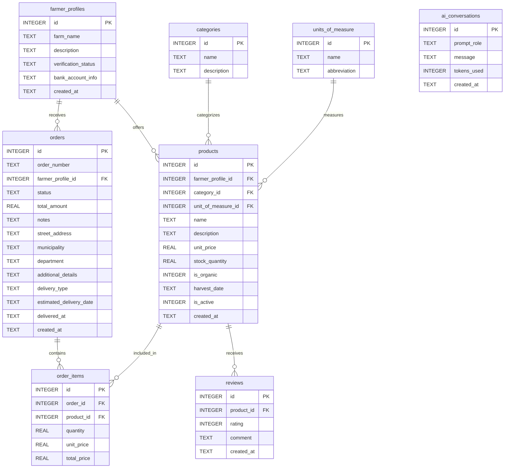
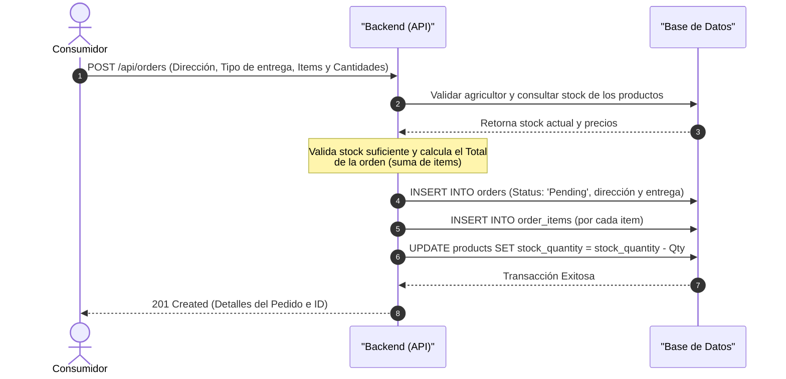
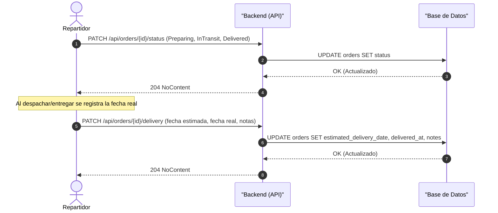
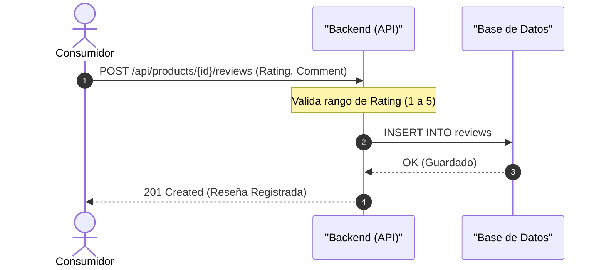
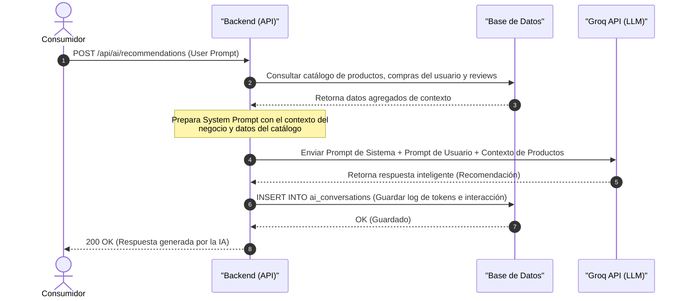

# Agromarket Local

**Autores:**
- **Jorge Bolivar (Backend)**
- **Bryan Pacheco (Backend IA)**
- **Lizeth Anay Bedoya Bolívar (QA)**

**AgroMarket Local** es una plataforma integral de comercio electrónico diseñada para conectar directamente a los agricultores con los consumidores urbanos, eliminando intermediarios y garantizando productos frescos con trazabilidad completa.

**Características:**
- **Catálogo de Productos:** Gestión completa de productos con categorías y unidades de medida.
- **Gestión de Pedidos:** Flujo completo de pedidos con estados.
- **Logística:** Gestión de entregas y despachos.
- **Reseñas:** Sistema de reseñas para productos.
- **IA:** Integración con GROQ API para análisis inteligente de datos.

## Esquema de Base de Datos

A continuación se muestra el diagrama de entidad-relación (ERD) de la base de datos generada a partir de `schema.sql`:

## Estado Actual del Proyecto

El backend está construido con **ASP.NET Core 8 (.NET 8)** con la estructura base creada en `MarketPlace/`.

**Implementado:**
- **Capa de modelos** (`Models/`) con clases para las 8 tablas del esquema: `FarmerProfile`, `Categorie`, `UnitOfMeasure`, `Product`, `Order`, `OrderItem`, `Review` y `AiConversation`.
- **Enums** para las columnas con restricciones `CHECK`: `VerificationStatus`, `StatusOrder`, `DeliveryType` y `PromptRole`.
- **Controladores** (`Controllers/`) agrupados por dominio: perfiles de agricultores, catálogo (categorías, unidades, productos y reseñas), pedidos (incluye dirección de envío y entrega) e IA.
- **Capa de datos**: EF Core + SQLite (`Data/AppDbContext.cs`); la base de datos se crea automáticamente desde `schema.sql` al iniciar la aplicación por primera vez.
- **Swagger / OpenAPI** con documentación XML de todos los endpoints.

**Pendiente:**
- Autenticación y autorización por rol (Agricultor / Consumidor / Administrador).
- Integración real con la API de Groq para recomendaciones con IA (el endpoint `POST /api/ai/recommendations` responde actualmente con un stub).
- Módulo de pagos (fuera de alcance; la entrega se programa al crear la orden).

## Flujos del Sistema (Diagramas Mermaid)

En esta sección se presentan los flujos de interacción entre los clientes HTTP (Swagger, Postman o `MarketPlace.http`) y la API.

### 1. Registrar Productos (Agricultor)
Este flujo representa cómo un agricultor agrega un nuevo producto a su catálogo disponible en la plataforma.

---

### 2. Registrar Órdenes de Compra (Consumidor)
Este flujo detalla cómo un consumidor genera un pedido de compra mediante una solicitud HTTP.

---

### 3. Entrega de la Orden (Agricultor / Repartidor)
Lógica para actualizar el estado de la orden y registrar los datos de entrega.

---

### 4. Registro de Reseña (Consumidor)
Lógica para que un consumidor califique un producto adquirido.

---

### 5. Recomendaciones con IA (Consumidor & Backend IA)
Interacción con la API de Groq para sugerir productos o analizar datos usando modelos de lenguaje (diseño objetivo; el endpoint responde actualmente con un stub).

## Endpoints de la API

La siguiente tabla detalla los posibles endpoints que componen la API del sistema:

| Módulo | Método | Endpoint | Descripción | Acceso / Rol |
| :--- | :---: | :--- | :--- | :--- |
| **Identidad / Perfiles** | `POST` | `/api/farmer-profiles` | Registrar un nuevo perfil de agricultor | Público |
| | `GET` | `/api/farmer-profiles/{id}` | Obtener información detallada de un agricultor | Público |
| **Catálogo** | `GET` | `/api/categories` | Listar todas las categorías de productos | Público |
| | `GET` | `/api/units-of-measure` | Listar todas las unidades de medida | Público |
| | `GET` | `/api/products` | Buscar y listar productos (filtros por categoría, orgánico y agricultor) | Público |
| | `GET` | `/api/products/{id}` | Obtener el detalle de un producto específico | Público |
| | `POST` | `/api/products` | Publicar un nuevo producto en el catálogo | Agricultor |
| | `GET` | `/api/products/{id}/reviews` | Obtener las reseñas y valoración promedio de un producto | Público |
| | `POST` | `/api/products/{id}/reviews` | Registrar calificación y comentario para un producto | Público |
| **Pedidos** | `POST` | `/api/orders` | Crear una orden de compra con dirección de envío, tipo de entrega y artículos | Público |
| | `GET` | `/api/orders` | Listar todas las órdenes | Público |
| | `GET` | `/api/orders/{id}` | Obtener detalles y artículos (`order_items`) de un pedido | Público |
| | `PATCH` | `/api/orders/{id}/status` | Cambiar el estado del pedido (`Pending`, `Confirmed`, `Preparing`, `InTransit`, `Delivered`, `Cancelled`) | Público |
| | `PATCH` | `/api/orders/{id}/delivery` | Actualizar datos de entrega (fecha estimada, fecha real, notas) | Público |
| **IA (Groq)** | `POST` | `/api/ai/recommendations` | Obtener sugerencias de productos personalizadas o análisis de precios | Público |
